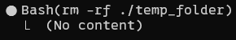
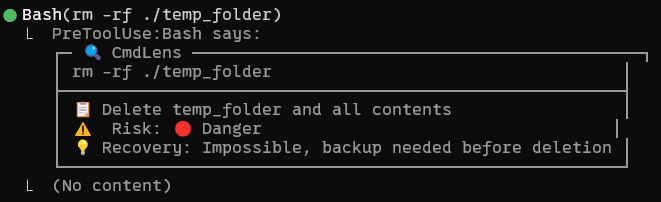
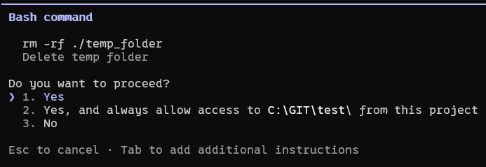
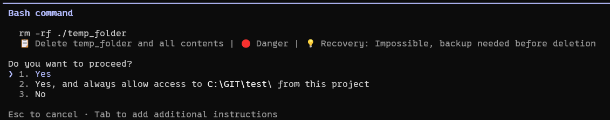

# CmdLens

**A Claude Code plugin that automatically explains commands before execution.**

> Every Bash command is displayed with risk level and recovery instructions.
> [한국어](./README.ko.md)
---

## Before & After

### Command Output

| Before | After |
|--------|-------|
|  |  |

### Permission Approval Screen

| Before | After |
|--------|-------|
|  |  |

---

## Features

- **Automatic Explanation** — Shows risk and recovery info for every command
- **Risk Level Indicator** — Visual assessment (🟢 Safe / 🟡 Caution / 🔴 Danger)
- **Recovery Guide** — How to undo, or warns if irreversible
- **Multilingual Support** — Explains in user's language (English/Korean)
- **Zero Dependencies** — No external API calls, no additional packages

---

## Installation

### Option 1: Marketplace (Recommended)

```bash
# Add marketplace
/plugin marketplace add choam2426/CmdLens

# Install plugin
/plugin install cmdlens@cmdlens-marketplace
```

### Option 2: Manual Installation

1. Clone the repository:

```bash
git clone https://github.com/choam2426/CmdLens.git
```

2. Copy plugin to Claude Code plugins directory:

```bash
cp -r CmdLens/plugins/cmdlens ~/.claude/plugins/
```

3. Restart Claude Code

---

## How It Works

```
Session Start
      ↓
SessionStart Hook → Inject description guide to Claude
      ↓
User requests task
      ↓
Claude prepares Bash command with description
      ↓
PreToolUse Hook → Display risk/recovery via systemMessage
      ↓
Command executes
```

**Hybrid Approach:** Combines SessionStart (behavior modification) and PreToolUse (display) for consistent, reliable output.

---

## Risk Levels

| Level | Icon | Description | Examples |
|-------|------|-------------|----------|
| Safe | 🟢 | Read-only, info query | `ls`, `cat`, `pwd`, `git status` |
| Caution | 🟡 | File modification | `mv`, `cp`, `chmod`, `git commit` |
| Danger | 🔴 | Deletion, system change | `rm -rf`, `sudo`, `git push --force` |

---

## Requirements

- Python 3.10+
- Claude Code

---

## Project Structure

```
CmdLens/
├── .claude-plugin/
│   └── marketplace.json
├── plugins/
│   └── cmdlens/
│       ├── .claude-plugin/
│       │   └── plugin.json
│       ├── hooks/
│       │   ├── hooks.json
│       │   ├── session_start.py
│       │   └── pre_tool_use.py
│       └── prompts/
│           └── description_guide.md
├── docs/
│   └── PRD.md
└── README.md
```

---

## License

[MIT](LICENSE)
